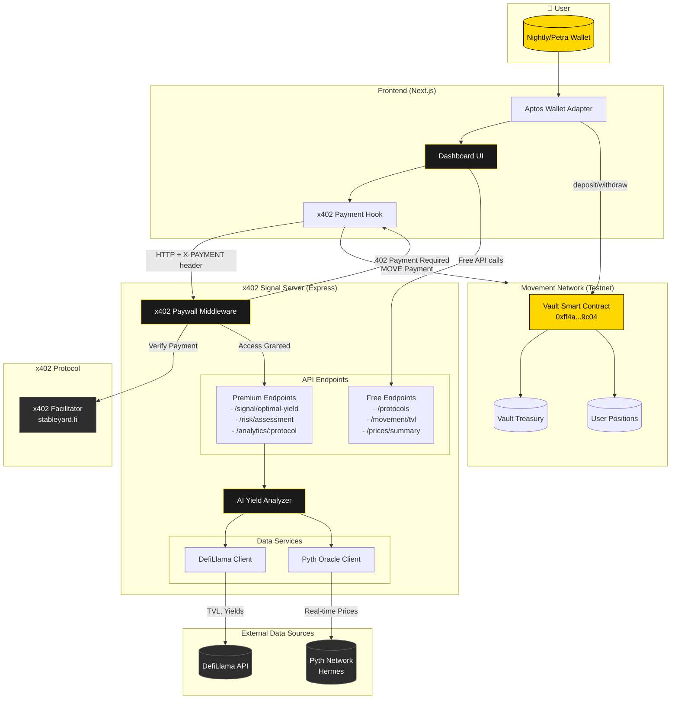
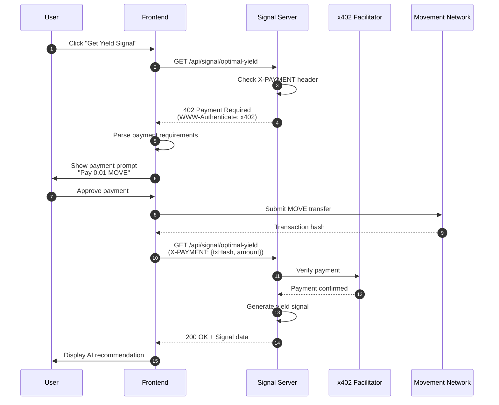
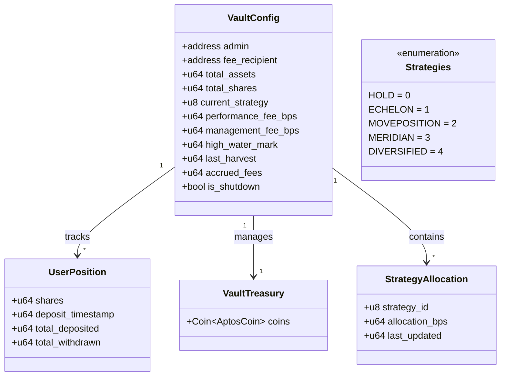
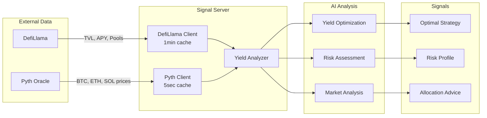
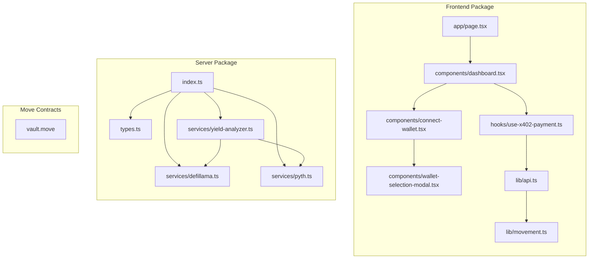
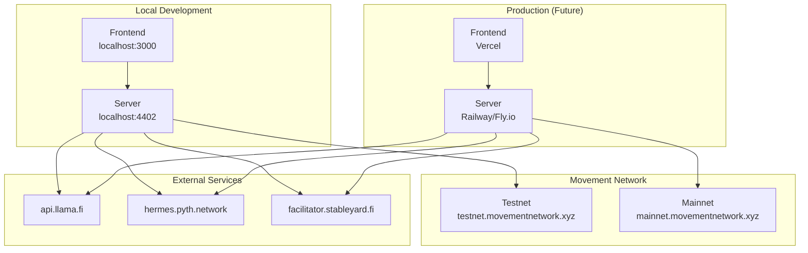
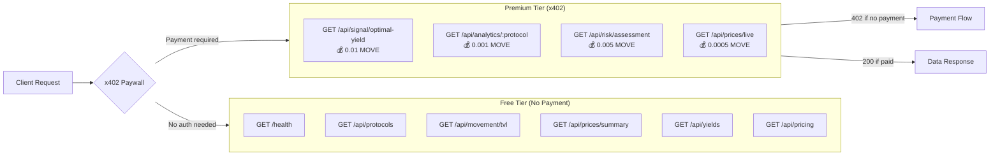

# YieldPilot Architecture

## System Overview Diagram

---

## x402 Payment Flow

---

## Smart Contract Structure

---

## Data Flow Architecture

---

## Component Diagram

---

## Deployment Architecture

---

## API Endpoint Map

---

## Technology Stack

| Layer | Technology | Purpose |
|-------|------------|---------|
| **Frontend** | Next.js 14 | React framework with App Router |
| | Tailwind CSS | Styling |
| | Aptos Wallet Adapter | Wallet connection |
| | Radix UI | Accessible components |
| **Backend** | Express.js | HTTP server |
| | TypeScript | Type safety |
| | x402plus | Micropayment paywall |
| **Blockchain** | Move | Smart contract language |
| | Movement Testnet | Deployment target |
| **Data** | DefiLlama API | TVL and yield data |
| | Pyth Network | Real-time price oracles |
| **Payments** | x402 Protocol | HTTP micropayments |
| | Stableyard Facilitator | Payment verification |

---

## Key Contract Addresses

| Component | Address | Network |
|-----------|---------|---------|
| YieldPilot Vault | `0xff4abeaf7290a4b229adab98cfd7ad2e4505511aea944a83b495148daffd9c04` | Movement Testnet |
| AptosCoin | `0x1::aptos_coin::AptosCoin` | Native |
| x402 Facilitator | `facilitator.stableyard.fi` | HTTPS |
